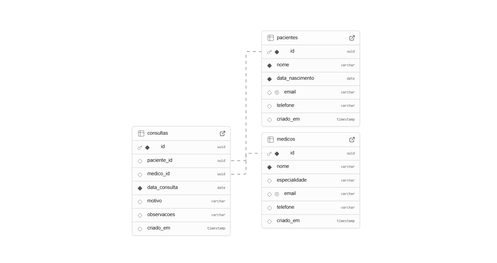

# Documento de Arquitetura Web (WAD)

## Sistema de Gerenciamento de Pacientes e Consultas

## Introdução

O Sistema de Gerenciamento de Pacientes e Consultas é uma aplicação web desenvolvida com Node.js e PostgreSQL para facilitar o controle clínico básico. Voltado a clínicas, consultórios ou profissionais da saúde, o sistema permite o cadastro de pacientes, registro de consultas e acompanhamento do histórico de atendimentos. Foi estruturado seguindo o padrão de projeto MVC (Model, View, Controller), o que facilita sua manutenção, escalabilidade e organização do código.

---

## Diagrama do banco de dados

Esse é o diagrama conceitual do banco de dados:



O SQL se encontra na pasta scripts

---

## Modelo físico do banco de dados

Esse é o modelo físico do banco de dados: 

```
-- Tabela de pacientes
create table IF NOT EXISTS pacientes (
  id uuid primary key default gen_random_uuid(),
  nome varchar(100) not null,
  data_nascimento date not null,
  email varchar(100) unique,
  telefone varchar(20),
  criado_em timestamp default now()
);

-- Tabela de médicos
create table IF NOT EXISTS medicos (
  id uuid primary key default gen_random_uuid(),
  nome varchar(100) not null,
  especialidade varchar(100),
  email varchar(100) unique,
  telefone varchar(20),
  criado_em timestamp default now()
);

-- Tabela de consultas
create table IF NOT EXISTS consultas (
  id uuid primary key default gen_random_uuid(),
  paciente_id uuid references pacientes(id) on delete cascade,
  medico_id uuid references medicos(id) on delete set null,
  data_consulta date not null,
  motivo varchar(255),
  observacoes varchar(500),
  criado_em timestamp default now()
);
```

### Finalidades do Sistema

- Cadastrar e armazenar informações dos pacientes
- Registrar consultas com data, motivo e observações
- Manter o vínculo entre consultas e seus respectivos pacientes
- Permitir futuras expansões, como login de usuários ou prontuários completos

### Delimitação do projeto

O sistema contempla o controle de duas entidades principais: pacientes e consultas. Cada consulta é associada a um paciente específico e pode conter informações como data, motivo e observações. O banco de dados foi estruturado com integridade referencial, utilizando UUID como identificador único para cada registro.

### Público-alvo

- Clínicas médicas e profissionais da saúde que desejam um controle básico de pacientes
- Desenvolvedores e estudantes interessados em aprender arquitetura web com Node.js e banco relacional

---

### Entidades Principais

*Estas são os users ( usuários ), que representam os usuários do sistema.*

1. **Pacientes**
   - Armazena os dados básicos do paciente, como nome, data de nascimento, telefone e e-mail
   - Cada paciente pode estar vinculado a múltiplas consultas

2. **Consultas**
   - Representa uma consulta médica realizada
   - Contém a data, motivo, observações e referência ao paciente correspondente

---

### Vínculos e associações

- Um paciente pode ter múltiplas consultas (1:N)
- Cada consulta pertence a um único paciente (N:1)

### Regras e restrições 

- O campo email dos pacientes é único no sistema
- O campo paciente_id nas consultas referencia diretamente um paciente válido
- A exclusão de um paciente implica na exclusão automática de suas consultas (ON DELETE CASCADE)
- O sistema utiliza UUID como chave primária para evitar colisões e garantir unicidade

## Arquitetura MVC

Neste projeto, a arquitetura MVC (Model-View-Controller), organiza o código em três camadas principais: 
- Models: responsáveis por lidar com os dados e executar comandos SQL;
- Controllers: recebem as requisições HTTP, processam a lógica e interagem com os Models;
- Views: exibem os dados para o usuário, como listas de pacientes e consultas, além de formulários para cadastro e edição. 


O diagrama acima ilustra como essas camadas se comunicam entre si e com o banco de dados, promovendo uma estrutura mais clara, modular e de fácil manutenção.

## Integração Frontend-Backend

### Exemplo de Integração com Fetch API
```javascript
// Busca dinâmica de médicos
async function pesquisarMedicos(termo) {
    const response = await fetch(`/api/medicos/buscar?nome=${termo}`);
    const dados = await response.json();
    atualizarTabelaMedicos(dados);
}

// Criação de nova consulta
async function criarConsulta(dados) {
    const response = await fetch('/api/consultas', {
        method: 'POST',
        headers: {
            'Content-Type': 'application/json'
        },
        body: JSON.stringify(dados)
    });
    return await response.json();
}
```
---

## Interface do Sistema

### Tela Principal

- Lista unificada de pacientes, médicos e consultas
- Pesquisa dinâmica integrada
- Botões de ação para cada registro que conecta com o banco de dados

### Como acessar ao servidor

- Após realizar os passos de como executar o sistema no readme, digite no terminal: 
```
node .\src\app.js
```
- Acesse no navegador:

http://localhost:3001

---

## Mudanças Relevantes

### Backend
- Implementação de pesquisa em tempo real
- Sistema de paginação para listas grandes
- Validações server-side
- Tratamento de erros centralizado

### Banco de Dados
- Índices otimizados para busca
- Triggers para logs de alterações
- Constraints de integridade
- Relacionamentos definidos