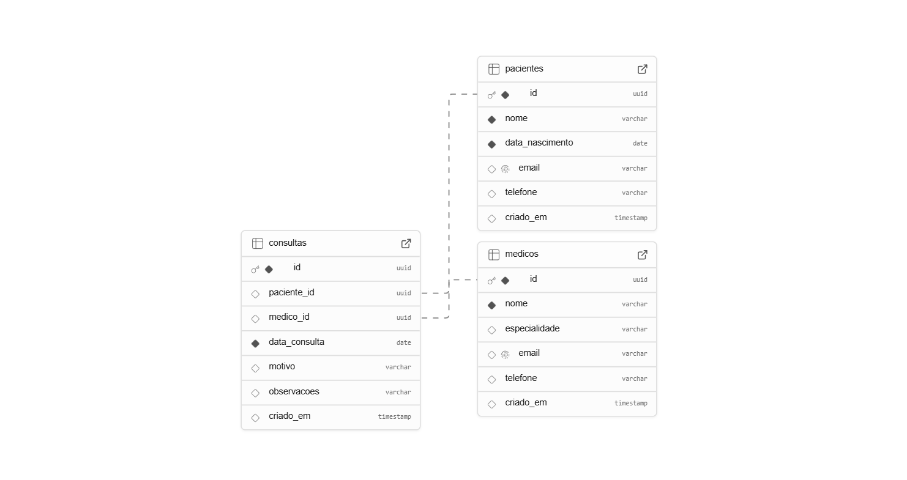

# Sistema de Gerenciamento de Pacientes e Consultas
## Descrição do Sistema

O Sistema de Gerenciamento de Pacientes e Consultas é uma aplicação web desenvolvida em Node.js, utilizando o padrão de arquitetura MVC (Model-View-Controller) e PostgreSQL como banco de dados. O sistema permite o gerenciamento de pacientes e suas respectivas consultas médicas.

---
## Características do projeto

Este projeto é uma aplicação web para gerenciamento de pacientes e consultas médicas, desenvolvida em Node.js com banco de dados PostgreSQL e estrutura organizada no padrão MVC. Permite o cadastro de pacientes, registro de consultas, e mantém um relacionamento entre ambos com integridade referencial. O sistema inclui um modelo relacional bem definido, scripts SQL para criação do banco e documentação clara para execução local, sendo facilmente extensível para novas funcionalidades.

---
## Estrutura de pastas 

```
meu-projeto1/
│
├── config/                # Arquivos de configuração (ex: conexão com banco)
│   └── database.js
├── controllers/           # Lógica de controle das requisições
│   └── HomeController.js
├── models/                # Definição de modelos de dados (estrutura do banco)
│   └── User.js
├── routes/                # Definição das rotas do sistema
│   └── index.js
├── services/              # Serviços auxiliares do sistema
│   └── userService.js
├── assets/                # Arquivos públicos como imagens e fontes
├── scripts/               # Arquivos de JavaScript públicos
├── styles/                # Arquivos CSS públicos
├── tests/                 # Arquivos de testes unitários
│   └── example.test.js
├── .gitignore             # Arquivo para ignorar arquivos no Git
├── .env                   # Arquivo de exemplo para variáveis de ambiente
├── jest.config.js         # Arquivo de configuração do Jest
├── package-lock.json      # Gerenciador de dependências do Node.js
├── package.json           # Gerenciador de dependências do Node.js
├── readme.md              # Documentação do projeto (Markdown)
├── server.js              # Arquivo principal que inicializa o servidor
└── rest.http              # Teste de endpoints (opcional)

```
---
## Modelo de dados
*As entidades principais do projeto são os users ( usuários ), que representam os usuários do sistema.*
- Paciente:
Representa a pessoa atendida no sistema e cada paciente pode ter várias consultas associadas.
- Consulta: 
Representa um atendimento médico realizado para um paciente e está sempre vinculada a um único paciente.

Esse é o diagrama conceitual do banco de dados:


O SQL se encontra na pasta scripts

##  Como Executar o Projeto Localmente
### Pré-requisitos

- Node.js (versão 14 ou superior)
- PostgreSQL (versão 12 ou superior)
- npm
---
## Passos

1. Clone o repositório:
```
git clone https://github.com/sofiaarone/meu-projeto1.git
cd meu-projeto1
```
2. Instale as dependências:
```
npm install
```
3. Configure as variáveis de ambiente:

Crie um arquivo .env na raiz do projeto com o seguinte conteúdo:

```
DB_HOST=localhost
DB_PORT=5432
DB_USER=seu_usuario
DB_PASSWORD=sua_senha
DB_NAME=meu_projeto1
Configure o banco de dados:
```
4. Configure o banco de dados:
- Certifique-se de que o PostgreSQL está em execução.
- Crie o banco de dados:
```
createdb -U seu_usuario meu_projeto1
```
- Execute o script SQL:
```
psql -U seu_usuario -d meu_projeto1 -f scripts/schema.sql
```
5. Inicie a aplicação:
```
npm start
```
6. Acesse no navegador:

http://localhost:3000

## Informações adicionais

A documentação WAD.md está aqui: https://github.com/sofiaarone/meu-projeto1/blob/main/docs/wad.md
